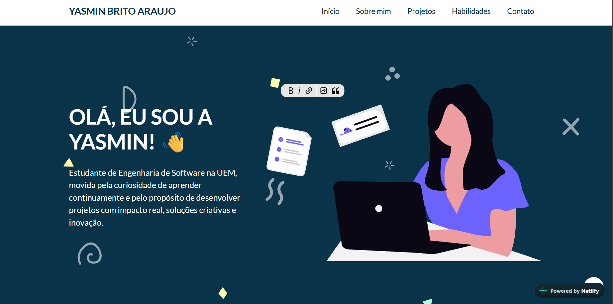

Portfólio Pessoal | Yasmin Brito

Bem-vindo(a) ao meu portfólio pessoal! Este projeto foi desenvolvido para apresentar minhas habilidades, projetos e trajetória como estudante de **Engenharia de Software na UEM**.

**Acesse o site no ar:** (https://portfolioyasminb.netlify.app)
-----
Preview

-----
Tecnologias e Ferramentas Utilizadas
- **HTML5:** Estrutura semântica e acessível.
- **CSS3:** Layouts flexíveis (Grid e Flexbox), variáveis de estilo e responsividade mobile-first.
- **JavaScript:** Interatividade e manipulação de eventos.
- **Git & GitHub:** Controle de versão.
- **Netlify:** Hospedagem e deploy contínuo.
-----
Seções do Site
- **Início:** Apresentação inicial.
- **Sobre Mim:** Detalhes sobre minha formação em Engenharia de Software na UEM e objetivos profissionais.
- **Projetos:** Exibição dos principais projetos desenvolvidos (como a Calculadora de IMC).
- **Habilidades:** Tabela de competências e áreas de interesse em tecnologia.
- **Contato:** Formulário para envio de mensagens e links diretos.
-----
Como executar o projeto?
   ```bash
   git clone [https://github.com/ayasbrito/Portfolio](https://github.com/ayasbrito/Portfolio)
